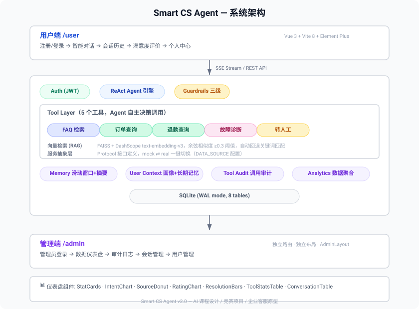

# 智能客服 Agent — Smart CS Agent

[](LICENSE)
[](CHANGELOG.md)
[](https://www.python.org/)
[](https://vuejs.org/)
[](https://fastapi.tiangolo.com/)

基于 **LangChain ReAct Agent** 的智能客服系统，LLM 自主决策调用工具，支持 RAG 语义检索、SSE 流式推送、跨会话记忆、安全护栏与数据审计。前后端分离，用户端与管理端独立运行。

> 适合作为 AI 应用课程设计、竞赛项目或企业客服系统的原型参考。

## 系统架构



<details>
<summary>点击展开 ASCII 文本架构图</summary>

```
┌─────────────────────────────────────────────────┐
│                   用户端 (/)                      │
│   登录/注册 → 对话 → 历史管理 → 满意度评价        │
└──────────────────────┬──────────────────────────┘
                       │ SSE Streaming / REST API
┌──────────────────────▼──────────────────────────┐
│              FastAPI 后端 (8000)                  │
│  ┌─────────┐  ┌────────┐  ┌──────────────────┐  │
│  │ Auth    │  │ ReAct  │  │ Guardrails       │  │
│  │ (JWT)   │  │ Agent  │  │ (3-level safety) │  │
│  └─────────┘  └───┬────┘  └──────────────────┘  │
│                   │                              │
│  ┌────────────────▼──────────────────────────┐   │
│  │          Tool Layer (5 tools)              │   │
│  │  FAQ检索 │ 订单查询 │ 退款查询 │ 故障诊断   │   │
│  │  ┌───────┴──────┐  ┌───────┴──────┐       │   │
│  │  │ 向量检索(RAG) │  │ 服务抽象层    │       │   │
│  │  │ FAISS+DashScope│  │ mock ⇄ real  │       │   │
│  │  └──────────────┘  └──────────────┘       │   │
│  └───────────────────────────────────────────┘   │
│  ┌──────┐ ┌──────┐ ┌──────────┐ ┌───────────┐  │
│  │Memory│ │User  │ │Tool Audit│ │Analytics  │  │
│  │      │ │Context│ │          │ │           │  │
│  └──────┘ └──────┘ └──────────┘ └───────────┘  │
│                   │                              │
│  ┌────────────────▼──────────────────────────┐   │
│  │         SQLite (WAL mode, 8 tables)        │   │
│  └───────────────────────────────────────────┘   │
└──────────────────────┬──────────────────────────┘
                       │
┌──────────────────────▼──────────────────────────┐
│               管理端 (/admin)                     │
│   管理员登录 → 数据仪表盘 → 审计日志 → 会话管理   │
└─────────────────────────────────────────────────┘
```

</details>

## 核心能力

| 能力 | 说明 |
|------|------|
| **ReAct 推理** | LLM 自主 Think→Act→Observe 循环，非固定流水线 |
| **RAG 语义检索** | DashScope text-embedding-v3 + FAISS，余弦相似度匹配，自动回退关键词 |
| **Tool Calling** | 5 个工具自主决策调用，支持超时与重试 |
| **SSE 流式** | 实时 token 流 + thinking 反馈 + 工具调用状态推送 |
| **Memory** | 滑动窗口(8条) + LLM 长对话摘要(>16条) + 跨会话长期记忆 |
| **用户画像** | 自动聚合意图分布、转人工率、满意度评分 |
| **Guardrails** | 三级安全体系(BLOCK/WARN/SAFE)，23 种中英文注入模式 + 内容安全检测 |
| **Observability** | Agent 推理链路可视化 + 工具调用审计日志 |
| **Error Recovery** | Agent 失败自动降级，SSE 断连自动回退非流式 |
| **Human-in-loop** | 自动转人工 + 手动转人工 |
| **多模型路由** | 按输入复杂度自动选择轻量/完整模型 |
| **服务抽象层** | Protocol 接口，mock/real 一键切换 |

## 项目结构

```
smart-cs-agent/
├── smart-cs-web/               # 前端 — Vue 3 + Vite 8 + Element Plus
│   ├── src/
│   │   ├── views/              # 页面组件
│   │   │   ├── LoginView.vue       # 用户登录/注册
│   │   │   ├── ChatView.vue        # 对话主界面
│   │   │   ├── ProfileView.vue     # 个人中心
│   │   │   ├── AdminLoginView.vue  # 管理员登录
│   │   │   └── AdminView.vue       # 管理后台仪表盘
│   │   ├── components/
│   │   │   ├── layout/             # AppLayout / AdminLayout
│   │   │   ├── chat/               # 9 个聊天相关组件
│   │   │   └── admin/              # 7 个管理端组件（图表/统计）
│   │   ├── composables/        # Vue 组合式函数
│   │   ├── stores/             # Pinia 状态管理 (auth/chat/admin)
│   │   ├── utils/              # API 客户端 / SSE 解析 / Markdown / 格式化
│   │   ├── router/             # Vue Router (用户端 + 管理端双路由)
│   │   └── types/              # TypeScript 类型定义
│   ├── package.json
│   ├── tsconfig.json
│   └── vite.config.ts
├── smart-cs-server/            # 后端 — FastAPI 0.110+ + LangChain 0.3+
│   ├── app/
│   │   ├── main.py             # API 路由入口 + lifespan
│   │   ├── agent.py            # ReAct Agent + 5 工具定义
│   │   ├── vector_store.py     # FAISS + DashScope 向量存储
│   │   ├── knowledge_base.py   # FAQ 知识库 (10 条)
│   │   ├── memory.py           # 滑动窗口 + LLM 摘要
│   │   ├── user_context.py     # 跨会话记忆 + 用户画像
│   │   ├── guardrails.py       # 三级安全护栏 (23 种模式)
│   │   ├── database.py         # aiosqlite + WAL, 8 张表
│   │   ├── auth.py             # JWT + bcrypt
│   │   ├── config.py           # 配置读取
│   │   ├── models.py           # Pydantic 模型
│   │   ├── admin_cli.py        # 管理员账号 CLI 工具
│   │   └── services/           # 服务抽象层 (Protocol + mock)
│   │       ├── base.py
│   │       ├── mock_service.py
│   │       └── __init__.py
│   ├── .env.example            # 配置模板 (25 项)
│   ├── requirements.txt
│   └── run.py                  # 启动入口 (uvicorn)
├── docs/                       # 文档与可视化资产
│   └── scripts/                # SVG 生成脚本
├── LICENSE
├── CHANGELOG.md
├── CONTRIBUTING.md
├── UPGRADE_ROADMAP.md
├── .gitignore
└── README.md
```

## 快速启动

### 环境要求
- Python 3.10+
- Node.js 18+
- DeepSeek API Key（LLM 推理，必填）
- DashScope API Key（向量检索，可选，未配置自动回退关键词匹配）

### 1. 后端

```bash
cd smart-cs-server

# 创建虚拟环境
python -m venv venv

# 安装依赖
venv/Scripts/pip install -r requirements.txt   # Windows
# venv/bin/pip install -r requirements.txt      # Linux/Mac

# 配置
cp .env.example .env
# 编辑 .env 填入 DEEPSEEK_API_KEY，可选填入 EMBEDDING_API_KEY

# 启动
venv/Scripts/python run.py   # Windows
# venv/bin/python run.py      # Linux/Mac
```

后端运行在 `http://localhost:8000`。首次启动自动创建默认管理员账号 `admin / admin123`。

### 2. 前端

```bash
cd smart-cs-web

# 安装依赖
npm install

# 开发模式（自动代理到后端 :8000）
npm run dev
```

- 用户端: `http://localhost:5173` → 注册/登录 → 对话
- 管理端: `http://localhost:5173/admin/login` → 管理员登录 → 数据仪表盘

### 3. 管理员账号管理

```bash
cd smart-cs-server
venv/Scripts/python -m app.admin_cli create-admin <用户名> <密码> [显示名]
venv/Scripts/python -m app.admin_cli list-users
venv/Scripts/python -m app.admin_cli set-role <用户名> <role>
```

## API 概览

| Endpoint | Method | 认证 | 说明 |
|----------|--------|------|------|
| `/api/health` | GET | 无 | 健康检查 |
| `/api/auth/register` | POST | 无 | 用户注册(固定 user 角色) |
| `/api/auth/login` | POST | 无 | 登录(返回 JWT + role) |
| `/api/auth/me` | GET | JWT | 当前用户+画像+记忆 |
| `/api/sessions` | GET/POST | JWT | 会话列表 / 创建 |
| `/api/sessions/:id` | GET/PATCH | JWT | 会话详情 / 更新 |
| `/api/sessions/:id/close` | POST | JWT | 关闭会话(提取记忆) |
| `/api/chat` | POST | JWT | 非流式对话 |
| `/api/chat/stream` | POST | JWT | SSE 流式对话 |
| `/api/sessions/:id/messages` | GET | JWT | 消息历史 |
| `/api/ratings` | GET/POST | JWT | 满意度评价 |
| `/api/analytics` | GET | Admin | 管理后台数据 |
| `/api/tool-audit` | GET | Admin | 工具调用审计 |

## SSE 事件格式

```
data: {"type": "thinking", "content": "正在查询订单 ORD-xxx 的信息…"}
data: {"type": "token", "content": "您"}
data: {"type": "tool_start", "tool": "query_order", "input": {"order_id": "ORD20260610001"}}
data: {"type": "tool_end", "tool": "query_order", "output": {...}, "duration_ms": 120}
data: {"type": "done", "intent": "order", "source": "system", "confidence": 0.95, ...}
```

## 技术栈

| 层面 | 技术 |
|------|------|
| 后端框架 | FastAPI 0.110+ |
| Agent 框架 | LangChain 0.3+ (ReAct) |
| LLM | DeepSeek (deepseek-chat) |
| 向量化 | DashScope text-embedding-v3 + FAISS |
| 数据库 | aiosqlite + WAL 模式 |
| 认证 | JWT (python-jose) + bcrypt |
| 前端框架 | Vue 3 (Composition API) |
| UI 库 | Element Plus |
| 状态管理 | Pinia |
| 构建工具 | Vite 8 |

## 配置说明

完整配置项见 `smart-cs-server/.env.example`：

| 变量 | 必填 | 说明 |
|------|------|------|
| `DEEPSEEK_API_KEY` | 是 | DeepSeek API Key |
| `EMBEDDING_API_KEY` | 否 | DashScope API Key（不填则 RAG 回退关键词匹配） |
| `DATA_SOURCE` | 否 | `mock`（默认）或 `real`（需实现 real_service.py） |
| `JWT_SECRET_KEY` | 否 | JWT 签名密钥（生产环境务必修改默认值） |
| `LIGHT_MODEL` | 否 | 轻量模型名称（不填则禁用多模型路由） |

## License

MIT © 2026 lpk
